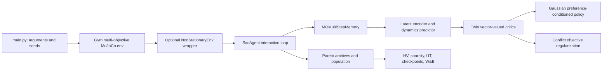

# COLAv2 Project Handoff: Progress, Architecture, and Non-Stationary MORL

**Snapshot date:** 2026-08-15  
**Repository:** COLAv2  
**Current direction:** Extend the stationary COLA multi-objective reinforcement
learning codebase to non-stationary MORL through a reusable environment wrapper.

## 1. Executive summary

COLAv2 is an implementation of COLA (Conflict Objective Regularization in
Latent Space), a preference-conditioned, general-policy multi-objective
reinforcement learning system built around Soft Actor-Critic. The existing
project trains one stochastic policy across a simplex of objective preferences,
uses a latent dynamics model to share representations between preferences, and
regularizes critic updates when gradients induced by different preferences
conflict.

The newest work adds the environment-side foundation for **non-stationary
MORL**. A separate `NonStationaryEnv` Gym wrapper can now alter dynamics or
other core environment parameters at randomized global timesteps. It supports
Gym spaces, SciPy frozen distributions, random-generator callables, constants,
per-parameter distribution mappings, and a built-in bounded or unbounded normal
distribution. This design wraps the existing Ant, Hopper, HalfCheetah,
Walker2d, Swimmer, and Humanoid environments without duplicating each class.

Current status:

- The original COLA training, model, replay, archive, evaluation, and MuJoCo
  environment code is present.
- The generic non-stationary wrapper, randomized scheduler, and normal
  distribution helper are implemented in `environments/non_stationary.py`.
- The wrapper is exported by `environments/__init__.py` and documented in
  `README.md`.
- Sixteen focused wrapper/scheduler/CLI integration tests pass.
- No new dependency was added; the implementation respects
  `environmentV2.yml`.
- `main.py` now applies the wrapper before constructing `SacAgent` when the
  `--non-stationary` flag is present. Without that flag, the original
  stationary environment object is preserved.
- An end-to-end MuJoCo smoke test still needs to be run in the exact legacy
  environment. The current workstation has Gym 0.26.2, while this project
  requires Gym 0.15.3; the base MuJoCo constructor APIs are incompatible.

## 2. Existing project objective

The stationary code addresses general-policy MORL. Rather than training one
policy for one scalar reward, it learns a policy conditioned on a preference
vector:

$$
\omega \in \Omega = \left\{\omega \in \mathbb{R}_{+}^{m} :
\sum_{i=1}^{m}\omega_i = 1\right\}.
$$

Each environment produces a vector reward
$\mathbf{r}(s,a) \in \mathbb{R}^{m}$. For a selected preference $\omega$, the
usual linear scalarized return is

$$
J_{\omega}(\pi) =
\mathbb{E}_{\pi}\left[\sum_{k=0}^{\infty}\gamma^k
\omega^{\top}\mathbf{r}_{t+k}\right].
$$

The practical target is a single policy $\pi(a\mid s,\omega)$ that covers many
trade-offs and approximates the Pareto front. The code evaluates this coverage
with hypervolume (HV), sparsity, and average utility (UT) over a preference
grid.

## 3. New problem formulation: non-stationary MORL

The new formulation makes the environment dynamics time-dependent. Let
$\theta_t$ represent physical or task parameters at global step $t$, such as
body masses, contact friction, joint damping, actuator gear, gravity, or the
simulation timestep. The time-indexed multi-objective MDP is

$$
\mathcal{M}_t =
(\mathcal{S},\mathcal{A},P_{\theta_t},\mathbf{r}_{\theta_t},\gamma).
$$

Non-stationarity occurs at event times $\tau_1,\tau_2,\ldots$. For event $k$:

$$
\Delta\tau_k \sim \mathcal{D}_{\text{time}},\qquad
\tau_k = \tau_{k-1}+\left\lceil\Delta\tau_k\right\rceil,
$$

and an alteration degree is sampled as

$$
d_k \sim \mathcal{D}_{\text{degree}}.
$$

At the event, the wrapper applies a transformation
$\theta_{\tau_k}^{+}=U(\theta,d_k)$. Four update semantics are implemented:

- `scale`: $\theta^{+}=\theta_0\,d_k$; the original parameter is the baseline,
  so changes do not compound.
- `add`: $\theta^{+}=\theta_0+d_k$.
- `multiply`: $\theta^{+}=\theta^{-}d_k$; changes compound over events.
- `set`: $\theta^{+}=d_k$.

The current wrapper does not append $\theta_t$ to the observation. From the
agent's point of view, the regime change is therefore hidden and must be
inferred from transitions or absorbed through robust/adaptive learning. The
replay buffer also mixes samples from different regimes. This is a meaningful
research choice, but it should be made explicit in experiments: a later version
may optionally record a regime identifier, parameter context, or change flag in
the replay transition.

The intended research objective is to learn a preference-conditioned policy
that both covers objective trade-offs and remains effective as the environment
changes:

$$
\max_{\pi}\; \mathbb{E}_{\omega,\{\theta_t\}}
\left[J_{\omega}(\pi;\{\theta_t\})\right],
$$

while measuring not only final Pareto quality but also robustness, adaptation
speed after each change, and performance loss relative to stationary regimes.

## 4. Core COLA architecture



### 4.1 Entry point and experiment configuration

`main.py`:

- Parses environment, device, preference-conditioning, latent-model, critic,
  regularization, replay, and checkpoint settings.
- Forces W&B offline mode and limits CPU math libraries to one thread.
- Imports `environments`, which performs Gym registration as an import side
  effect.
- Creates the base task with `gym.make(args.env_id)` and conditionally wraps it
  through `wrap_environment_from_args(...)`.
- Builds a configuration dictionary and starts `SacAgent.run(...)`.
- Uses 3,000,000 environment steps by default (overridable with `--num_steps`), a replay size of
  one million, batch size 256, learning rate $3\times10^{-4}$, and 10,000
  initial exploration steps.

The current default `env_id` is the registered `MO-Ant-v2`; `run.sh` provides
the full task-specific experiment commands.

### 4.2 Agent and training loop

`agent.py` contains the main `SacAgent` implementation:

- Samples preference vectors from the objective simplex. `MO-Ant-v5` uses a
  special hierarchical sampling construction.
- Executes complete episodes, initially with random actions and later with the
  stochastic Gaussian policy.
- Stores state, preference, action, vector reward, next state, and termination
  state in the replay buffer.
- Learns an objective-agnostic latent state and a latent next-state predictor.
- Learns twin vector-valued Q functions and scalarizes their vector outputs
  using the active preference.
- Learns a tanh-squashed Gaussian policy with automatic entropy tuning.
- Maintains target critic and target encoder networks through soft or optional
  hard updates.
- Stores historical critic snapshots in `QMemory`; the policy loss considers
  the current critic and those retained critics across a preference set.
- Maintains nondominated policy archives (`EP` and `Real_EP`) and a performance
  buffer population.
- Periodically computes HV, sparsity, and UT, writes NumPy summaries, saves
  model checkpoints, and logs to W&B/Visdom.

### 4.3 Objective-agnostic latent dynamics model (OADM)

`Latent_Encoder` in `model.py` contains:

- `z_encoder`: maps state $s_t$ to latent state $z_t$.
- `z_dynamic_pre`: maps $(z_t,a_t)$ to predicted next latent state
  $\hat z_{t+1}$.

The implemented dynamics loss is

$$
L_{\mathrm{dyn}}=
\mathbb{E}\left[\left\|
g_{\psi}(f_{\phi}(s_t),a_t)-f_{\bar\phi}(s_{t+1})
\right\|_2^2\right].
$$

This representation is especially relevant to the new non-stationary setting:
changes in $P_{\theta_t}$ should appear as changes in transition prediction
error or latent dynamics. No explicit change detector is implemented yet.

### 4.4 Twin vector critic and policy

`TwinnedQNetwork` contains two `QNetwork` heads that output one value per reward
objective. Critic targets use the preference-scalarized minimum of the twin
critics while retaining a vector Bellman target. `GaussianPolicy` produces a
tanh-squashed action distribution and supports deterministic mean actions for
evaluation.

The constructor flags choose combinations of latent state, original state,
action, and preference as network inputs. Some flag names are historical: the
critic's second positional input is named `actions` inside `model.py`, but the
agent passes the preference there after action effects have already been
encoded through the latent transition.

### 4.5 Conflict Objective Regularization (COR)

The critic computes TD losses for the current preference and a sampled other
preference. `Conflict_caculate` extracts gradient vectors and computes their
cosine similarity (called stiffness in the code). When similarity is below
`regular_bar`, a consistency penalty to the previous critic is activated:

$$
L_Q^{\mathrm{total}} = L_Q +
\max(\beta-\mathrm{cos}(g_{\omega},g_{\omega'}),0)
\,\alpha_{\mathrm{reg}}L_{\mathrm{consistency}}.
$$

`PCGrad` is also implemented as an optional alternative for projecting
conflicting gradients.

### 4.6 Replay, archives, and metrics

- `base.py`: vector-reward replay memory (`MOMemory`) and circular storage for
  historical critics (`QMemory`).
- `multi_step.py`: multi-step vector reward accumulation; the current main
  configuration uses `multi_step=1`.
- `population_2d.py`: performance-buffer population, nondominated filtering,
  sparsity/HV utilities, and prediction-guided selection logic. In the current
  main path it is primarily updated as an archive; the run commands set
  `EA_policy_num=0` and `RL_policy_num=0`.
- `hypervolume.py`: dimension-general recursive hypervolume implementation.
- `agent.py`: preference grids, nondominated archives, utility, sparsity, and
  logging/checkpoint orchestration.
- `mod_neuro_evo.py` and `mod_utils.py`: evolutionary mutation/crossover,
  prioritized-memory utilities, action normalization, tracking, and
  serialization support. These appear to be inherited/experimental support
  code rather than the active core path in `main.py`.
- `motivation.py` and `motivation_agent.py`: a parallel experimental training
  path. It imports `ES.ISODD`, which is not present in this repository, so it
  should not be treated as the primary runnable entry point.

## 5. Included multi-objective environments

Importing `environments` registers the following main tasks:

| Registered ID | Objectives returned by `step` | Horizon |
|---|---|---:|
| `MO-Ant-v2` | x velocity, y velocity, including control/survival terms | 500 |
| `MO-Ant-v3` | x velocity, y velocity, energy/control objective | 500 |
| `MO-Ant-v4` | four limb energy/speed combinations | 500 |
| `MO-Ant-v5` | forward velocity and four per-limb energy objectives | 500 |
| `MO-Hopper-v2` | running speed and jump height | 500 |
| `MO-Hopper-v3` | running, jumping, energy | 500 |
| `MO-Hopper-v5` | running, jumping, and three actuator-group energy terms | 500 |
| `MO-HalfCheetah-v2` | running and energy | 500 |
| `MO-New-HalfCheetah-v2` | alternative two-objective running/energy version | 500 |
| `MO-HalfCheetah-v5` | running, jumping, and three energy terms | 500 |
| `MO-Walker2d-v2` | speed and energy | 500 |
| `MO-Swimmer-v2` | forward motion and control efficiency | 500 |
| `MO-Humanoid-v2` | running and energy | 1000 |
| `MO-Humanoid-v5` | five grouped energy objectives; speed is retained in `info` | 1000 |
| `MO-Ant-v5000` | long-horizon Ant variant | 5000 |

The invalid `MO-Humanoid-v6` registration was removed because its source file
does not exist. The README also uses some `-2d`/`-3d` names that do not match the actual Gym
registration IDs. For continuation work, `environments/__init__.py` and
`run.sh` are the authoritative sources.

All of these environments use the legacy four-value Gym API:

```text
observation, vector_reward, done, info
```

and expose `reward_num`, an action space, an observation space, and the MuJoCo
`model`/`sim` objects needed by the new wrapper.

## 6. Non-stationary wrapper implementation

The implementation is isolated in `environments/non_stationary.py` and exports
four public names:

### `NormalDistribution`

- Samples from `rng.normal(mean, standard_deviation)`.
- Supports scalar or shaped samples.
- Optional `low` and `high` bounds clip outliers. This is a clipped/censored
  normal, not a mathematically truncated normal.
- For true truncation, a frozen `scipy.stats.truncnorm` can be supplied directly.

### `RandomizedScheduler`

- Samples a positive interval from `interval_distribution`.
- Adds optional `interval_offset`; this makes Gym `Discrete(n)` convenient.
- Rounds fractional samples upward to a whole environment step.
- Maintains `current_step`, `last_interval`, and `next_update_step`.
- Resamples the next interval after every event.

### `NonStationaryEnv` / `NonStationaryWrapper`

- Subclasses `gym.Wrapper`, so action/observation spaces and ordinary Gym
  behavior remain available.
- Resolves parameter paths relative to `env.unwrapped`, allowing it to wrap a
  Gym `TimeLimit` around any included task.
- Captures original parameter values when constructed.
- Calls `update()` immediately before the underlying action at the scheduled
  one-based global step.
- Applies `scale`, `add`, `multiply`, or `set` updates.
- Supports one shared degree or a mapping of independent distributions keyed by
  parameter path.
- Accepts a custom `update_fn(unwrapped_env, degree)` for arbitrary mutations,
  including changing only one body or one array slice.
- Calls `sim.forward()` after updates when available.
- Uses independent, seed-derived random streams for scheduling and degree
  sampling and forwards the seed to the base environment.
- Keeps its clock across episode resets by default. Set
  `reset_schedule_on_env_reset=True` for episode-local non-stationarity.
- Adds an event record to `info["non_stationary_update"]` only on changed
  transitions. It also exposes `elapsed_steps`, `next_update_step`, and
  `last_update`.
- Provides `update(degree=...)`, `reset_scheduler()`, and
  `restore_parameters()` for manual control.
- Accepts both legacy four-element and modern five-element step tuples, though
  the rest of COLAv2 is written for Gym 0.15's four-element API.

Supported distribution forms are:

1. Gym spaces such as `gym.spaces.Box` and `gym.spaces.Discrete`.
2. `NormalDistribution` from this project.
3. Frozen SciPy distributions with `rvs(random_state=...)`, including `norm`
   and `truncnorm`.
4. Callables that accept the wrapper's NumPy random generator.
5. Constants, useful for controlled ablations.
6. Degree mappings, one distribution per parameter path.

Useful MuJoCo parameter paths shared by the current tasks include:

- `model.body_mass`
- `model.geom_friction`
- `model.dof_damping`
- `model.actuator_gear`
- `model.opt.gravity`

### Normal-distribution initialization example

```python
import gym

from environments import NonStationaryEnv, NormalDistribution

base_env = gym.make("MO-Ant-v2")
env = NonStationaryEnv(
    base_env,
    parameter_paths="model.body_mass",
    degree_distribution=NormalDistribution(
        mean=1.0,
        standard_deviation=0.10,
        low=0.80,
        high=1.20,
    ),
    interval_distribution=NormalDistribution(
        mean=300,
        standard_deviation=75,
        low=100,
        high=500,
    ),
    change_mode="scale",
    seed=1,
)
```

This keeps mass changes concentrated around the original mass and change times
concentrated around 300 steps while preventing invalid or extreme tails.

### Uniform Gym-space initialization example

```python
env = NonStationaryEnv(
    gym.make("MO-Ant-v2"),
    parameter_paths="model.body_mass",
    degree_distribution=gym.spaces.Box(0.8, 1.2, shape=(1,)),
    interval_distribution=gym.spaces.Discrete(401),
    interval_offset=100,
    seed=1,
)
```

This samples a mass scale uniformly from 0.8 to 1.2 and an interval uniformly
from the integers 100 through 500.

## 7. How environment initialization currently works

The shared initialization path in `main.py` is:

```python
from environments import *  # registers task IDs
from environments.non_stationary import (
    add_non_stationary_arguments,
    wrap_environment_from_args,
)

env = gym.make(args.env_id)
env = wrap_environment_from_args(env, args, seed=args.seed)
agent = SacAgent(env_id=args.env_id, env=env, log_dir=log_dir, **configs)
```

`wrap_environment_from_args` returns the exact base environment when
`--non-stationary` is absent. When the flag is present, it constructs
`NonStationaryEnv` before `SacAgent` reads the spaces, reward dimensions,
horizon, and seed method.

The implemented CLI supports:

- repeatable `--ns-parameter` paths (default `model.body_mass`);
- `--ns-degree-distribution normal|uniform`;
- degree mean, standard deviation, low, and high values;
- `--ns-interval-distribution normal|uniform`;
- interval mean, standard deviation, low, and high values;
- `--ns-change-mode scale|add|multiply|set`;
- optional `--ns-reset-on-env-reset`.

Non-stationary runs receive a `_NonStationary_...` W&B run-name suffix and are
written below `logs/<env-id>/non_stationary/` so they do not overwrite the
stationary run directory.

Example:

```bash
python main.py \
  --env_id MO-Ant-v2 \
  --seed 1 \
  --non-stationary \
  --ns-parameter model.body_mass \
  --ns-degree-distribution normal \
  --ns-degree-mean 1.0 --ns-degree-std 0.1 \
  --ns-degree-low 0.8 --ns-degree-high 1.2 \
  --ns-interval-distribution normal \
  --ns-interval-mean 300 --ns-interval-std 75 \
  --ns-interval-low 100 --ns-interval-high 500 \
  --ns-change-mode scale
```

There are deliberately no separate non-stationary IDs because each base ID can
be combined with different parameters and distributions. The authoritative
base ID registrations are in `environments/__init__.py`.

## 8. Validation performed

`tests/test_non_stationary.py` currently contains 16 passing tests. They
cover:

- sampled intervals and offsets;
- rejection of invalid non-positive intervals;
- bounded, reproducible normal intervals;
- normal sample shape, bounds, and standard-deviation validation;
- updates occurring before the action at the due step;
- non-compounding `scale` behavior;
- separate degrees for multiple parameters;
- nested MuJoCo-style attribute paths;
- `sim.forward()` after a parameter update;
- `scale`, `add`, `multiply`, and `set` semantics;
- arbitrary custom update callbacks;
- reproducible Gym-space degree samples;
- scheduler time spanning episode resets by default;
- restoration of original parameters and update metadata;
- stationary pass-through when the CLI flag is absent;
- normal and uniform CLI construction paths;
- invalid CLI interval validation.

Validation command:

```bash
python -B -m unittest discover -s tests -v
```

Result on this workstation: **16 tests passed**.

An actual `MO-Ant-v2` construction was attempted locally, but the workstation
has Gym 0.26.2. It failed inside the legacy base environment because Gym 0.26's
`MujocoEnv.__init__` requires an `observation_space` argument that Gym 0.15 did
not require. This is an environment-version mismatch, not a wrapper unit-test
failure. End-to-end validation must use the pinned legacy runtime.

## 9. Runtime and dependency constraints

Treat `environmentV2.yml` as the requested target constraint:

- Python 3.8
- Gym 0.15.3
- NumPy 1.21.6
- SciPy 1.7.3
- PyTorch 1.13.1 / CUDA 11.7
- pymoo 0.6.0
- W&B, TensorBoard, and Visdom

The new wrapper uses only Gym and NumPy, so it adds no dependency.

There are two environment specifications with important differences:

- `environmentV2.yml` is the newer requested constraint and now lists
  `mujoco-py==2.0.2.9` and `fastrand==1.8.0` explicitly.
- `environment.yml` is an older Python 3.7 / PyTorch 1.3.1 environment and does
  list `mujoco-py==2.0.2.9` plus system-era dependencies.

Because the included tasks inherit from `gym.envs.mujoco.MujocoEnv`, the next
machine may need the legacy MuJoCo and `mujoco-py` setup even after creating the
V2 Conda environment. Reconcile this carefully without upgrading Gym unless all
base environment classes are migrated together.

`requirements.txt` mirrors the high-level V2 package versions but includes
Conda package names such as `python`, `pytorch`, and `pytorch-cuda`; it should
not be assumed to be a universally valid pip-only lockfile.

## 10. Known gaps and risks

The following items are not yet solved:

1. **CLI expressiveness:** repeated parameter paths currently share one sampled
   degree; independent per-parameter distributions remain available through
   the Python API rather than the CLI.
2. **Exact MuJoCo integration test:** wrapper tests use a lightweight mock;
   validation in Gym 0.15.3 + `mujoco-py` is pending.
3. **Checkpoint continuation:** scheduler clock, RNG state, current parameter
   values, and last update are not included in `SacAgent` checkpoints.
4. **Non-stationary evaluation protocol:** no metrics yet measure pre-change
   performance, immediate performance drop, recovery time, or area under the
   adaptation curve.
5. **Regime observability:** the parameter/change context is available in
   `info`, but the agent discards `info` and replay does not store it.
6. **Replay under drift:** old and new regimes are mixed without timestamps,
   stratification, decay, or regime-aware sampling.
7. **Change safety:** broad scales on mass, friction, gravity, damping, or gear
   can destabilize MuJoCo. Experiments should use positive bounded
   distributions and environment-specific ranges.
8. **Documentation/ID mismatch:** some README examples use IDs not registered by
   the package. Use `run.sh` and `environments/__init__.py` for valid names.

The 2026-08-16 logic-fix pass resolved the former n-step/preference replay bugs,
applied all three loss coefficients, removed the invalid Humanoid registration,
and added multi-dimensional reference directions to the population buffer.

## 11. Recommended next steps

Suggested order of work:

1. Recreate the exact Python 3.8 / Gym 0.15.3 / MuJoCo runtime and run
   `MO-Ant-v2` stationary smoke tests.
2. Wrap `MO-Ant-v2` with a conservative body-mass distribution and verify
   actual model values, `sim.forward()`, transitions, and deterministic seeds.
3. Run the documented `main.py --non-stationary` command and log the complete
   distribution specification in the exact legacy MuJoCo runtime.
4. Add scheduler and parameter state serialization to training checkpoints.
5. Decide whether non-stationarity is hidden, observed, or partially observed;
   update replay structure accordingly.
6. Define stationary and non-stationary evaluation protocols using the same
   event seeds and preference grids.
7. Add per-event logging: event step, sampled degree, changed values, HV/UT
   before and after change, and recovery time.
8. Establish safe parameter ranges separately for Ant, Hopper, HalfCheetah,
   Walker2d, Swimmer, and Humanoid.
9. Only after the environment protocol is stable, evaluate whether latent
   transition error can act as a change signal and whether COR/history replay
   improves retention across regimes.

## 12. Handoff bundle contents

The accompanying ZIP is intended to give another Codex enough context without
including Git internals, IDE files, caches, logs, or trained checkpoints. It
contains:

- this handoff report and `README.md`;
- all root Python source files;
- `main.py`, `agent.py`, `model.py`, replay, metrics, population, and helper
  modules;
- `environmentV2.yml`, legacy `environment.yml`, `requirements.txt`, and
  `run.sh`;
- all environment Python definitions and MuJoCo XML assets;
- `environments/non_stationary.py` and `tests/test_non_stationary.py`;
- 3D/4D/5D preference-table `.npy` files;
- `LICENSE`.

When another Codex opens the bundle, it should start with this report, then
inspect `main.py`, `agent.py`, `model.py`, `environments/__init__.py`, and
`environments/non_stationary.py` in that order.
